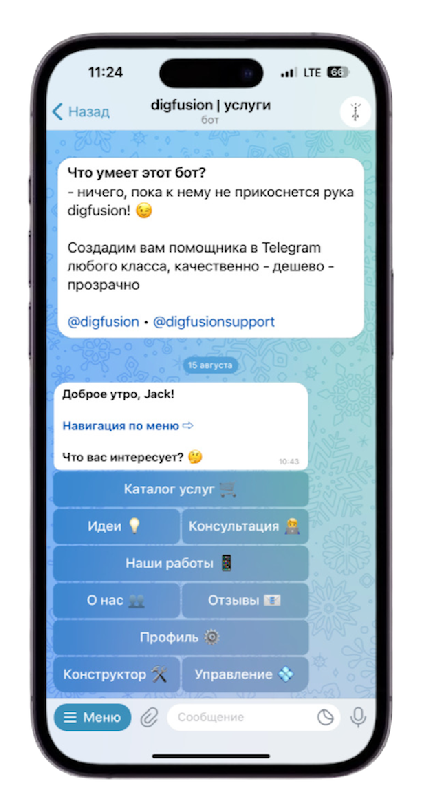
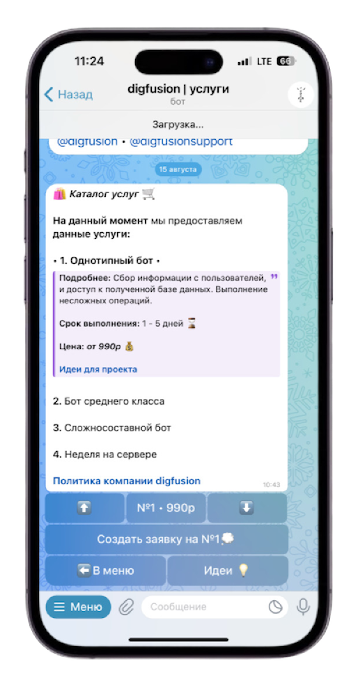

<h1>About</h1>
<h3>Platform for services of our company <i><a href="https://t.me/digfusion">digfusion</a></i> in Telegram!</h3>

<h3>if it sounds interesting, visit <i><a href="https://t.me/digfusionbot">digfusionbot</a></i></h3>

##

<!-- <h2><i>be educated - is simple</i> 😉</h2> -->

<h1>сontact us</h1>

<kbd>you can contact us through <a href="https://t.me/digfusionbot">digfusionbot,</a> as well as through contacts above
</kbd>

<!--  -->

